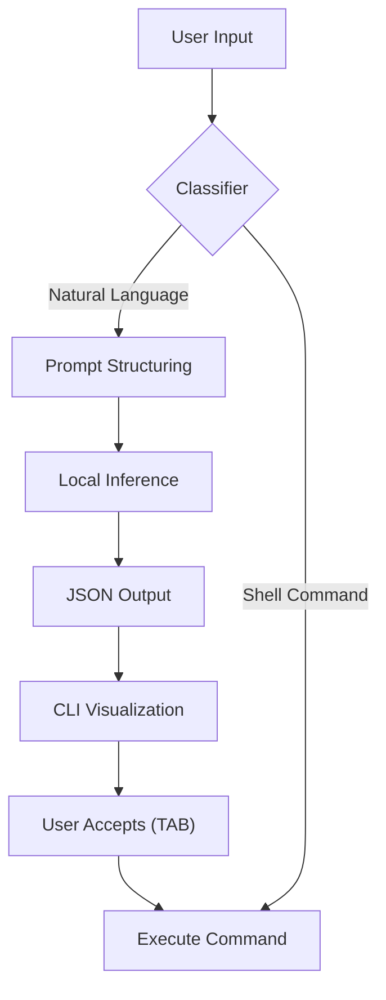

# GenShell Native C Architecture: Ground-Up and Pure CLI

GenShell is a native shell application built Ground-Up in C. This approach ensures maximum performance and minimal overhead, supporting the Open Core business model.

The architecture is now designed for a pure CLI experience, focusing on efficiency and speed, where the AI output is injected directly into the standard terminal input/output flow.

**We will actively explore new modes of interactions** such as the idea of a Visual Context Injector Module that captures and interprets the user's physical gestures via video camera to dynamically enrich the LLM prompt, or a simple double enter to accept then execute command.

## Modular Architecture and AI Flow

| Module               | Primary Responsibility                                                                     | Language |
| -------------------- | ------------------------------------------------------------------------------------------ | -------- |
| Shell Core (Kernel)  | REPL (Read-Eval-Print-Loop), fork()/execve() management, Essential Built-ins (cd, export). | C        |
| Context Engine       | Real-time data gathering (CWD, history, stderr) and structured LLM prompt formatting.      | C        |
| LLM Runner           | LLM inference management (binding to llama.cpp or Core ML).                                | C/C++    |

## Total Command Coverage (100% Compatibility)

GenShell achieves 100% coverage of all possible POSIX commands (sh, bash, zsh) despite being a Ground-Up shell, through a strategy of selective execution and delegation.

### Selective Execution Principle

- **Internal Commands (Built-ins):** GenShell directly executes only the essential Built-ins (cd, pwd, export, etc.) implemented in C in a lean manner and adhering to the POSIX standard.
- **External Commands/Scripts (Bash/Sh/Zsh):** For all more complex commands and scripts (.sh, .zsh, etc.), GenShell delegates execution to the correct interpreter specified in the Shebang (#!/bin/bash or #!/bin/sh) or to the binary found in the $PATH.
- **Mechanism:** GenShell uses C system calls (fork() and execve()) to launch the native system interpreter binary, ensuring total compatibility with any existing command or script.

## User Experience: Operational Flow and LLM Contract (Pure CLI Mode)

The flow is optimized for traditional terminal speed:

## Extensibility and Community Add-ons (The Ecosystem)

To give GenShell the scope of a large Open Source project, the Core will be extensible via Dynamically Loadable Modules (DLMs).

### Extensibility Strategy: Dynamic C Modules

GenShell exposes an API for DLMs, allowing the community to write C code that is loaded upon shell startup.

## llama.cpp Gemma Runner Prototype

- **Shim Layout:** `include/gemma_llama.h` exposes a C-first interface built on top of `llama.cpp`. The implementation in `src/gemma_llama.cpp` handles backend init, prompt evaluation, and token sampling (top-k/top-p/temperature) while streaming decoded text through a callback.
- **Sample Client:** `src/gemma_cli.c` demonstrates the minimal integration: load a Gemma 3 4B instruction-tuned GGUF (`gemma-3-text-4b-it-4bit.gguf`), feed a prompt, and echo tokens into the terminal.
- **Build Sketch:**
  - Convert the HF checkpoints to GGUF via `python3 convert-hf-to-gguf.py mlx-community/gemma-3-text-4b-it-4bit --outfile models/gemma-3-text-4b-it-4bit.gguf` inside the `llama.cpp` repo.
  - Compile: `clang++ -std=c++20 -Iinclude -I/path/to/llama.cpp -L/path/to/llama.cpp/build src/gemma_llama.cpp src/gemma_cli.c -lllama -o bin/gemma_cli` (adjust include/lib paths for your build layout).
- **Runtime Notes:** The shim defaults to a 4K context, 512-token batches, and repetition penalty tuned for instruction chat. Swap in shell I/O by wiring the callback to the REPL accept/execute loop.
