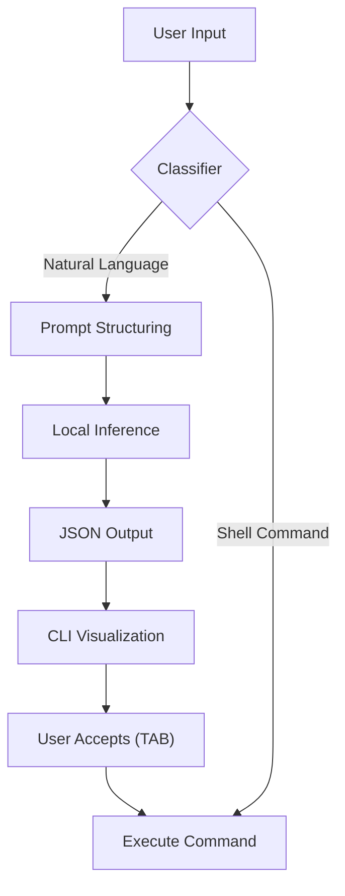

# LLM Sidecar (Qwen via llama.cpp)

GenShell ships with an optional helper binary, `gemma_cli`, that runs a local Qwen2.5-Coder-3B-Instruct checkpoint through llama.cpp (Gemma remains available for legacy validation). The shell must remain safe and responsive when the sidecar is unavailable; integration happens through a narrow shim that generates command suggestions and requires explicit user confirmation (`TAB`) before execution.

## Operational Flow


## Building the Helper
1. Initialise the submodule when first enabling the assistant:
   ```bash
   git submodule update --init --recursive
   ```
2. Build llama.cpp static libraries using the platform helper:
   ```bash
   ./build_mac_complete.sh   # Metal-enabled macOS
   # or
   ./build_pc_complete.sh    # CPU-only Linux/Windows
   ```
3. Re-run the regular helper with the `all` target if you skipped step 2:
   ```bash
   ./build_mac.sh all
   ./build_pc.sh all
   ```

## Preparing Models
Model download and quantization steps for both Qwen and Gemma live in `LLM_DOWNLOAD.md`. Store all GGUF files under `models/` (git-ignored). Launch the helper directly once you have a quantized checkpoint:
```bash
./bin/gemma_cli models/qwen2.5-coder-3b-instruct-q4_k_m.gguf "Write a portable shell test harness outline."
```

## Safety & Sampling Defaults
- Sampling defaults are configured in `src/llm/gemma_cli.c`; review the long comment documenting temperature, top-k, and other knobs before changing behaviour.
- High-risk commands (e.g., `rm -rf /`) are suppressed via a logit-bias block. Extend the list when exposing new workflows or running on shared systems.
- Maintain documentation of new flags in `gemma_sampling_config` and surface them through CLI parameters if relevant.

## Failure Modes
- The shell never blocks if the model is missing. Handle absence of `bin/gemma_cli` gracefully and continue executing handwritten commands.
- Network access is not required; keep inference fully local to honour repository portability expectations.
- Log inference errors through the shim but avoid crashing the shell. Treat inference suggestions as advisory.

For implementation notes and sampling defaults, review `src/llm` and `include/gemma_sampling_config.h` (when available). The helper still lives under the historical `gemma_cli` name while the shim migrates to Qwen-first defaults.
